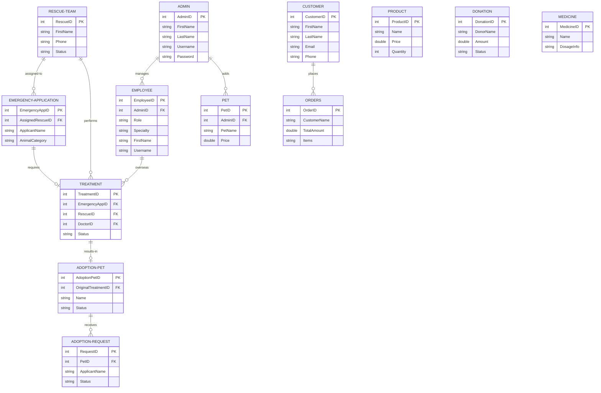

# Pets Care Management System - Database Design & Normalization

This document provides a comprehensive analysis of the database design for the Pets Care Management System, including an Entity-Relationship (ER) diagram and an evaluation of normal forms up to 3NF.

## 1. Entity-Relationship (ER) Diagram

The following Mermaid diagram illustrates the relationships and cardinalities between the entities in the system.

## 2. Normalization Analysis (Up to 3NF)

A relational database is fully normalized to the 3rd Normal Form (3NF) if it satisfies the rules of 1NF, 2NF, and has no transitive dependencies.

### **First Normal Form (1NF)**
**Rule:** Each table cell should contain a single atomic value, and each record needs to be unique.
- **Status in Project:** Mostly fulfilled. Every entity uses a unique `ID` (Primary Key). 
- **Minor Exception:** The `Orders` table uses an `Items` field (stored as a string/JSON) to store multiple purchased products in one column. While standard NoSQL or modern JSON-supported databases accept this as a snapshot, strict relational 1NF dictates creating an `Order_Item` associative table. For the scope of this project, this denormalization is highly efficient and acceptable, but it's worth noting for academic strictness.

### **Second Normal Form (2NF)**
**Rule:** Must be in 1NF, and all non-key attributes must be fully functionally dependent on the entire primary key (no partial dependency).
- **Status in Project:** Fully Fulfilled.
- Since all tables in this project use a single, auto-incremented surrogate key (e.g., `AdminID`, `EmployeeID`), there are no composite primary keys. Therefore, partial dependencies are structurally impossible.

### **Third Normal Form (3NF)**
**Rule:** Must be in 2NF, and all non-key attributes must depend strictly on the primary key, and not on other non-key attributes (no transitive dependency).
- **Status in Project:** Fully Fulfilled.
- In tables like `Treatment` and `EmergencyApplication`, fields describe only the primary key. E.g., `ApplicantName` and `AnimalCategory` in `EmergencyApplication` rely strictly on the `EmergencyAppID`.
- We correctly use Foreign Keys (`AdminID`, `RescueID`, `DoctorID`) instead of copying dependent data (like the Doctor's name into the Treatment table), completely avoiding transitive dependency anomalies.

## 3. Database Constraints Implementation

To fulfill the requirement of explicit constraints (PRIMARY KEY, FOREIGN KEY, CHECK), a comprehensive standalone SQL script has been written. 

The raw SQL commands with proper relational integrity mapping are stored in the project directory file: `database_schema.sql`.

The SQL schema contains:
* **PRIMARY KEY** constraints on all IDs.
* **FOREIGN KEY** constraints on relational mapping (e.g., `FOREIGN KEY (DoctorID) REFERENCES Employee(EmployeeID)`).
* **ON DELETE SET NULL / CASCADE** referential integrity rules to prevent orphan records.
* **CHECK constraints** (e.g., `CHECK (Price >= 0)`, `CHECK (Age >= 18)`) to enforce data validity.
