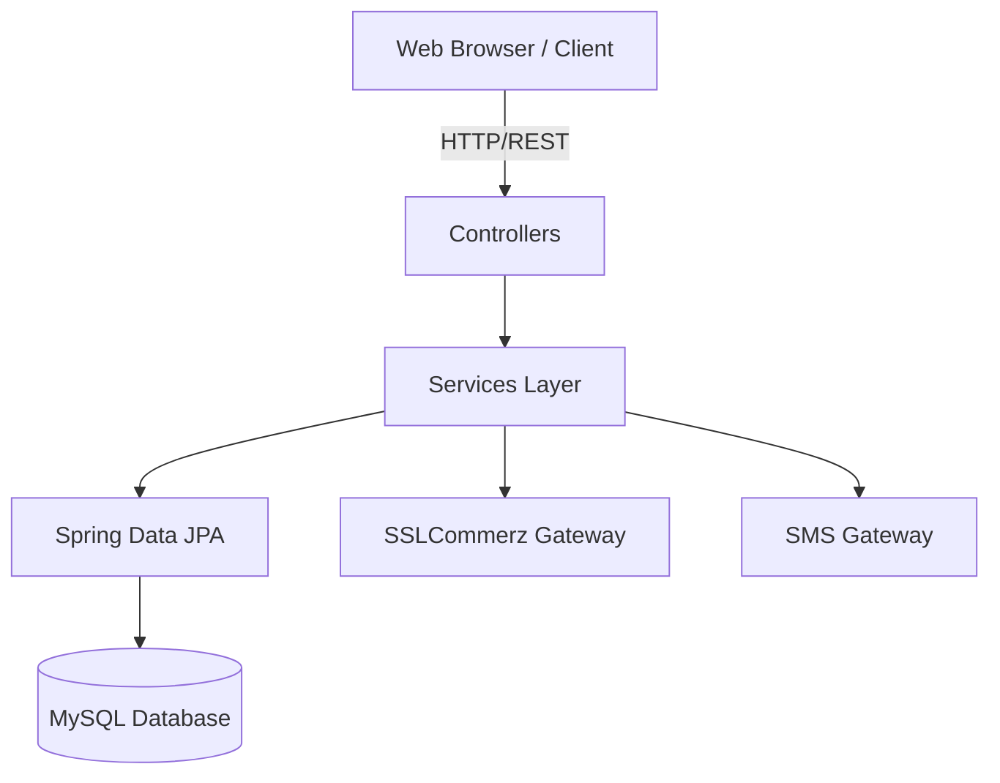

<div align="center">

# 🐾 Pets Care Management System v2.0


A comprehensive, enterprise-level system designed to streamline and automate pet rescue operations, medical treatments, adoptions, e-commerce, and charitable donations. 

[Explore Features](#-features-overview) • [Installation](#-quick-start-options) • [API Reference](#-api-endpoints)
</div>

---

## 🌟 Introduction

**Pets Care Management System** is a robust Spring Boot application that connects pet owners, veterinarians, rescue teams, and administrators into a single unified platform. Whether it's a critical emergency rescue, a routine medical checkup, or finding a forever home for a rescued pet, this system handles it all with real-time tracking and notifications.

### 🎉 What's New in v2.0
- 💰 **Donation System** - Fully integrated with SSLCommerz payment gateway.
- 📊 **Enhanced Admin Dashboard** - Real-time statistics and analytics.
- 🐾 **Improved Track Status** - Real-time emergency application tracking.
- 🙏 **Smart Thank You Pages** - Dynamic messages for donations and shop orders.

---

## 🚀 Quick Start Options

Get the application up and running in minutes using Docker, or set it up locally for development.

### Option 1: Docker (Recommended - Any OS)
The fastest way to run the application with all dependencies included.

1. Ensure **Docker Desktop** is installed and running.
2. Clone the repository.
3. Run the startup script:
   - **Windows:** Double-click `START-DOCKER.bat`
   - **Mac/Linux:** Run `./start-docker.sh`
4. Access the application at: `http://localhost:8080`

### Option 2: Local Development
For developers who want to modify the source code.

**Prerequisites:** Java 17, Maven, MySQL 8.0

1. Configure your database connection in `src/main/resources/application.properties`:
   ```properties
   spring.datasource.url=jdbc:mysql://localhost:3306/PetsCare
   spring.datasource.username=root
   spring.datasource.password=your_password
   ```
2. Build and run the application:
   ```bash
   mvn spring-boot:run
   ```

---

## 🔑 Default Credentials

Gain instant access to different dashboards using the following default accounts:

| Role | Username | Password | Login URL |
|------|----------|----------|-----------|
| 👑 **Admin** | `admin` | `admin123` | `http://localhost:8080/admin.html` |
| 🩺 **Doctor** | `rupa` | `1234` | `http://localhost:8080/doctor.html` |
| 🚑 **Rescue Team** | `rescue1` | `1234` | `http://localhost:8080/rescue.html` |

---

## 📱 Features Overview

<div align="center">
  
| 👥 For Customers | 🩺 For Doctors |
|------------------|----------------|
| • Submit emergency rescue requests<br>• Real-time application tracking<br>• Shop for pet products & supplies<br>• Apply for pet adoptions<br>• Make secure donations<br>• Receive SMS alerts | • View assigned emergency cases<br>• Manage treatments & prescriptions<br>• Request rescue team assistance<br>• Update patient recovery status<br>• Access complete medical history |

| 🚑 For Rescue Teams | 👑 For Administrators |
|---------------------|-----------------------|
| • View and accept assigned missions<br>• Navigate to emergency locations<br>• Log rescue operations<br>• Real-time doctor synchronization | • Unified analytics dashboard<br>• Manage all users & staff<br>• Track donations & revenue<br>• Manage e-commerce inventory<br>• Approve adoption requests |

</div>

---

## 🏗️ System Architecture

The project follows a standard monolithic Spring Boot architecture with a clear separation of concerns:



### 🛠️ Technology Stack
- **Backend:** Java 17, Spring Boot 3.2.3, Spring Security, Spring Data JPA
- **Database:** MySQL 8.0
- **Frontend:** HTML5, CSS3, Vanilla JavaScript
- **Integrations:** SSLCommerz (Payments), Bulk SMS BD API (Notifications)
- **DevOps:** Docker, Docker Compose, Maven

---

## 🗄️ Database Schema Highlights

The system relies on a highly normalized relational database structure. Key tables include:
- `EmergencyApplications` - Tracks all rescue requests.
- `Treatment` - Electronic health records for pets.
- `Orders` & `Products` - E-commerce engine.
- `AdoptionRequests` - Workflow for pet adoptions.
- `Donation` - Financial tracking for charity.

*(A fully populated `realistic_data.sql` file is included to seed the database for testing).*

---

## 🧪 API Endpoints

The application exposes a RESTful API for external integrations.

### 🌐 Public APIs
- `POST /api/emergency/submit` - Submit a new rescue request.
- `POST /api/track` - Check the status of an application.
- `GET /api/shop/products` - Retrieve available products.
- `POST /api/donation/init` - Initialize a donation session.

### 🔒 Secured APIs
- `GET /api/admin/stats` - Fetch dashboard analytics (Admin).
- `POST /api/admin/orders/{id}/approve` - Approve shop order (Admin).
- `GET /api/doctor/{id}/cases` - Fetch assigned cases (Doctor).
- `POST /api/rescue/complete/{id}` - Mark mission complete (Rescue Team).

---

## 🐛 Troubleshooting

| Issue | Solution |
|-------|----------|
| **Port 8080 already in use** | Change the port in `docker-compose.yml` or kill the blocking process (`lsof -ti:8080 \| xargs kill -9`). |
| **Database connection failed** | Ensure MySQL is running. Verify credentials in `application.properties` and ensure the `PetsCare` database exists. |
| **Payment gateway issues** | Verify SSLCommerz Sandbox credentials in the `PaymentConfig` configuration. |

---

## 📄 License & Contribution

This project was developed for educational purposes to demonstrate enterprise-level Java application development. Feel free to fork, modify, and use it for your own learning!

<div align="center">
Made with ❤️ by the Pets Care Team
</div>
